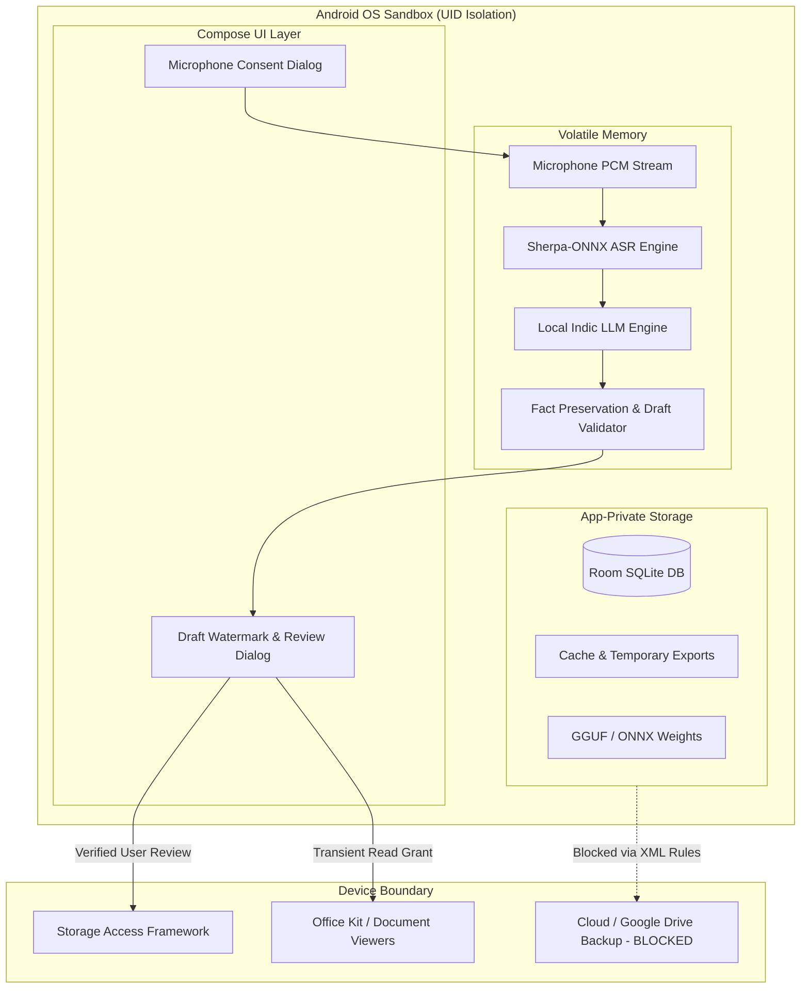

# VernAI Privacy & Security Architecture: STRIDE Threat Model & Security Checklist

**Classification:** Technical Security Architecture & Threat Specification  
**Application Target:** VernAI (Offline-First Telugu Multimodal Civic & Enterprise Assistant)  
**Target Platform:** Android 8.0+ (API 26 – API 36), Optimized for iQOO / vivo & Budget Indic Smartphones  
**Security Level:** High (Zero-Cloud Trust Architecture, Defense-in-Depth)

---

## 1. Executive Summary & Security Philosophy

VernAI is designed around an uncompromising **Zero-Cloud Trust Architecture**. Unlike cloud-connected AI assistants that stream user voice recordings, PII, financial ledgers, and grievance letters to remote servers, VernAI performs **100% of its inference, storage, and document processing on-device**.

### Key Security Axioms
1. **Zero Internet Perimeter:** The application does not declare `android.permission.INTERNET`. At the Linux kernel level, socket creation (`AF_INET`, `AF_INET6`) is prohibited.
2. **Zero Cloud Telemetry:** No third-party SDKs, analytics tracking (Firebase, Mixpanel), crash reporters (Sentry, Crashlytics), or remote loggers are integrated.
3. **Defense-in-Depth Storage:** App data is housed in Linux UID-isolated internal storage (`/data/user/0/com.vernai/`). All cloud backups (Google Drive, OEM cloud) are explicitly blocked via XML extraction rules.
4. **Anti-Hallucination Civic Safety:** LLM civic outputs are marked as draft copies (`[చిత్తు ప్రతి - ధృవీకరణ అవసరం]`). Export to legal PDF/DOCX formats requires mandatory, explicit citizen review to prevent AI-invented facts from causing legal harm.
5. **Cryptographic Erasure:** Sensitive ephemeral data (audio buffers, temporary export caches) is shredded using multi-pass overwrites (`0xFF`, `0x00`, `SecureRandom`) before filesystem unlinking.

---

## 2. STRIDE Threat Model



### 2.1 Spoofing (Identity & Origin)

| Threat ID | Threat Description | Attack Vector | Impact | Mitigations in VernAI | Verification Status |
| :--- | :--- | :--- | :--- | :--- | :--- |
| **S-01** | **Applicant / Authority Impersonation in Legal Petitions** | Adversary or AI invents non-existent official titles, false citizen names, or fake government stamps. | Fraudulent petition submission, administrative rejection, citizen legal liability. | 1. Prompt template forces explicit placeholders `[దరఖాస్తుదారుడి సంతకం]`, `[కార్యాలయ చిరునామా]` when input metadata is absent.<br>2. `TeluguLetterParser` enforces schema checks on salutations.<br>3. Review Dialog presents citizen identity before export. | **VERIFIED** (`TeluguLetterParserTest`, `LetterDraftReviewGuardrailTest`) |
| **S-02** | **Malicious App Intent Interception** | Rogue app registers intent filters for exported PDF/DOCX to snoop on citizen grievance. | PII exposure to malicious third-party apps on device. | 1. Use explicit package queries (`<queries>`) for official iQOO/vivo Office Kit packages (`com.vivo.office`, `com.vivo.easyshare`).<br>2. Scoped `FileProvider` URIs with transient `FLAG_GRANT_READ_URI_PERMISSION`. | **VERIFIED** (`IqooOfficeKitBridge`, `AndroidManifest.xml`) |

---

### 2.2 Tampering (Data & Integrity)

| Threat ID | Threat Description | Attack Vector | Impact | Mitigations in VernAI | Verification Status |
| :--- | :--- | :--- | :--- | :--- | :--- |
| **T-01** | **Model Weights Modification / Poisoning** | Malicious local process or sideload modifies GGUF/ONNX weights on external storage. | Model outputs biased, offensive, or hallucinated legal guidance. | 1. AI models stored strictly in app-private `context.filesDir/models/`.<br>2. Cryptographic SHA-256 integrity verification (`ModelIntegrityVerifier`) rejects tampered or incomplete models. | **VERIFIED** (`OfflineSecurityAndIntegrityTests`) |
| **T-02** | **Sales Ledger / Database Alteration** | Unchecked database modification alters daily revenue records. | Business records corrupted, shop owner financial loss. | 1. SQLite database protected by Linux UID boundary.<br>2. Foreign keys and WAL transaction isolation enabled in Room.<br>3. Exported files (CSV, XLSX) validated before writing. | **VERIFIED** (`TeluguDocumentExportTests`, `TeluguSalesProcessingTests`) |

---

### 2.3 Repudiation (Disavowal & Auditability)

| Threat ID | Threat Description | Attack Vector | Impact | Mitigations in VernAI | Verification Status |
| :--- | :--- | :--- | :--- | :--- | :--- |
| **R-01** | **Unreviewed AI Hallucination Disavowal** | Citizen claims: "The AI invented this bribe allegation / wrong date; I didn't write it." | Legal disputes, misinformation, defamation claims. | 1. All generated letters default to `isDraft = true`.<br>2. Prominent Telugu draft banner `[చిత్తు ప్రతి - ధృవీకరణ అవసరం]`.<br>3. Mandatory `LetterReviewConfirmationDialog` requires explicit user confirmation prior to clean export.<br>4. Unreviewed export embeds draft watermark directly in DOCX/PDF. | **VERIFIED** (`LetterDraftReviewGuardrailTest`, `DocxDocumentExporter`, `PdfDocumentExporter`) |
| **R-02** | **Disputed Sales Ledger Entry** | Customer or merchant disputes quantity or price extracted from voice. | Merchant-customer disputes. | 1. Deterministic arithmetic validator flags mismatches (`SalesValidationStatus.ARITHMETIC_MISMATCH`).<br>2. Ambiguous entries trigger high-visibility Compose clarification banner instead of AI guessing. | **VERIFIED** (`TeluguSalesProcessingTests`, `SalesLogScreen`) |

---

### 2.4 Information Disclosure (Privacy & Data Leaks)

| Threat ID | Threat Description | Attack Vector | Impact | Mitigations in VernAI | Verification Status |
| :--- | :--- | :--- | :--- | :--- | :--- |
| **I-01** | **Android Auto Backup Cloud Exfiltration** | Android 12+ cloud auto-backup syncs Room database and grievance letters to Google Drive. | Sensitive citizen grievances and shop finances leaked to cloud storage. | 1. `android:allowBackup="false"` in `AndroidManifest.xml`.<br>2. `backup_rules.xml` and `data_extraction_rules.xml` explicitly exclude `database`, `sharedpref`, `root`, `file`, and `external` domains. | **VERIFIED** (`PrivacyAndSecurityHardeningTests`) |
| **I-02** | **Logcat / System Log Snooping** | Logcat dumps expose voice transcripts, phone numbers, Aadhaar numbers, or ledger entries. | Local attackers or apps with `READ_LOGS` read user PII. | 1. Production code audited: zero transcript/audio logging.<br>2. `SecureLogger` automatically redacts phone numbers, Aadhaar numbers, emails, survey numbers, and currency amounts. | **VERIFIED** (`PrivacyAndSecurityHardeningTests`, `SecureLogger`) |
| **I-03** | **Remanence in NAND Flash Storage** | Audio recordings or exported drafts recovered from flash memory using forensic undelete. | Historical audio/drafts recovered from discarded or seized phones. | 1. Live audio processed in memory buffers with zero disk writes during streaming.<br>2. `SecureFileShredder` performs multi-pass overwrite (`0xFF`, `0x00`, `SecureRandom`) + `sync()` + 0-length truncation before unlinking. | **VERIFIED** (`PrivacyAndSecurityHardeningTests`, `SecureFileShredder`) |
| **I-04** | **Over-Permissioned File Sharing** | `FileProvider` exposes root files or grants permanent read/write access to third-party apps. | Other apps read entire app-private internal storage. | 1. `file_paths.xml` exposes only `<cache-path name="exports" path="exports/" />`.<br>2. Intents grant strictly transient `FLAG_GRANT_READ_URI_PERMISSION`. | **VERIFIED** (`file_paths.xml`, `AndroidManifest.xml`, `LocalDocumentExporter`) |

---

### 2.5 Denial of Service (Resource Starvation)

| Threat ID | Threat Description | Attack Vector | Impact | Mitigations in VernAI | Verification Status |
| :--- | :--- | :--- | :--- | :--- | :--- |
| **D-01** | **Out of Memory (OOM) during On-Device Inference** | Concurrent ASR and LLM execution exhausts RAM on 4GB/6GB low-end phones. | App crash, system UI stutter, OS Low Memory Killer (LMK) abort. | 1. `InferenceLock` mutual exclusion lock enforces single-flight execution.<br>2. Automatic model unloader kicks in on critical memory pressure callbacks.<br>3. ASR uses lightweight 16kHz chunked streaming. | **VERIFIED** (`InferenceLock`, `LlamaCppInferenceEngine`, `AudioRecordManager`) |
| **D-02** | **Storage Exhaustion from Cached Exports** | User repeatedly exports large PDF/DOCX files, filling internal flash storage. | Phone storage full, app unable to write DB records. | 1. `DataPrivacyManager` audits storage footprint.<br>2. Nuclear wipe option allows instant shredding of all export caches and database files. | **VERIFIED** (`DataPrivacyManager`, `OfflineSecurityAndIntegrityTests`) |

---

### 2.6 Elevation of Privilege

| Threat ID | Threat Description | Attack Vector | Impact | Mitigations in VernAI | Verification Status |
| :--- | :--- | :--- | :--- | :--- | :--- |
| **E-01** | **Microphone Eavesdropping / Silent Recording** | App silently records audio in background without user knowledge. | Eavesdropping on private family or business conversations. | 1. `AudioPermissionHandler` enforces explicit UI consent modal explaining local-only processing before requesting OS permission.<br>2. Prominent red recording indicator and stop button in UI during active capture.<br>3. Background recording impossible (no Foreground Service declared). | **VERIFIED** (`AudioPermissionHandler`, `SalesLogScreen`, `LetterEditorScreen`) |
| **E-02** | **Internet Permission Escalation** | Dependency or library secretly makes network calls. | Air-gap breach, telemetry leakage. | 1. `android.permission.INTERNET` is completely absent from manifest.<br>2. Linux kernel enforces network isolation at socket layer. | **VERIFIED** (`OfflineSecurityAndIntegrityTests`) |

---

## 3. Comprehensive Security Checklist

| Category | Security Control / Guardrail | Implemented In | Audit Verification Method | Status |
| :--- | :--- | :--- | :--- | :---: |
| **Network & Perimeter** | Zero `INTERNET` permission in Manifest | `AndroidManifest.xml` | `OfflineSecurityAndIntegrityTests.manifestSecurityAudit_confirmsNoInternetPermission` | ✅ PASS |
| **Network & Perimeter** | No remote telemetry, analytics, or crash reporters | `build.gradle.kts` | Dependency tree inspection | ✅ PASS |
| **Storage & Backup** | `android:allowBackup="false"` declared | `AndroidManifest.xml` | Manifest inspection | ✅ PASS |
| **Storage & Backup** | Legacy full backup rules exclude all domains (`root`, `database`, `sharedpref`, `file`, `external`) | `backup_rules.xml` | `PrivacyAndSecurityHardeningTests.testAutoBackupRules_excludeAllSensitiveStorageDomains` | ✅ PASS |
| **Storage & Backup** | Android 12+ data extraction rules exclude all domains from cloud backup and transfer | `data_extraction_rules.xml` | `PrivacyAndSecurityHardeningTests.testAutoBackupRules_excludeAllSensitiveStorageDomains` | ✅ PASS |
| **Storage & Backup** | Private internal directory usage for DB and models | `VernAiDatabase`, `ModelLifecycleManager` | Path inspection (`context.filesDir`, `context.cacheDir`) | ✅ PASS |
| **File Sharing** | Scoped `FileProvider` with minimal path exposure | `res/xml/file_paths.xml` | Restrict to `cache-path/exports` | ✅ PASS |
| **File Sharing** | Read-only transient intent permissions | `LocalDocumentExporter` | `FLAG_GRANT_READ_URI_PERMISSION` only | ✅ PASS |
| **Logging & PII** | Automated regex redaction for phone numbers, Aadhaar, survey numbers, and currency | `SecureLogger.kt` | `PrivacyAndSecurityHardeningTests.testSecureLogger_redacts*` | ✅ PASS |
| **Logging & PII** | Zero sensitive data logged to logcat in production | App codebase audit | Grep audit for `Log.` | ✅ PASS |
| **User Consent** | Explicit bilingual Telugu/English microphone consent dialog | `AudioPermissionHandler.kt` | Compose UI verification | ✅ PASS |
| **User Consent** | Clear explanation of local-only processing & memory shredding | `AudioPermissionHandler.kt` | UI text and layout audit | ✅ PASS |
| **LLM Guardrails** | Strict system prompt forbidding hallucinated names/dates | `TeluguLetterPromptTemplate.kt` | Template inspection | ✅ PASS |
| **LLM Guardrails** | Deterministic keyword/fact preservation validator | `TeluguLetterParser.kt` | `FactPreservationViolation` test | ✅ PASS |
| **LLM Guardrails** | Generated letters marked as draft copy | `LetterEditorContract.kt` | `isDraft = true` verification | ✅ PASS |
| **LLM Guardrails** | Prominent Draft Watermark Banner in Telugu UI | `LetterEditorScreen.kt` | Compose UI banner check | ✅ PASS |
| **LLM Guardrails** | Mandatory User Review Confirmation Dialog before export | `LetterEditorViewModel.kt`, `LetterEditorScreen.kt` | `PrivacyAndSecurityHardeningTests.testLetterDraftReviewGuardrail_*` | ✅ PASS |
| **LLM Guardrails** | Unreviewed export includes draft watermark in document | `DocxDocumentExporter`, `PdfDocumentExporter` | Export test verification | ✅ PASS |
| **Secure Deletion** | Cryptographic multi-pass file overwrite before delete | `SecureFileShredder.kt` | `PrivacyAndSecurityHardeningTests.testSecureFileShredder_*` | ✅ PASS |
| **Secure Deletion** | User-controlled nuclear wipe for all data & models | `DataPrivacyManager.kt` | `OfflineSecurityAndIntegrityTests.testNuclearDataPurge_cleansAllFiles` | ✅ PASS |
| **Model Integrity** | SHA-256 model checksum verification before load | `ModelIntegrityVerifier.kt` | `OfflineSecurityAndIntegrityTests.verifyChecksum_*` | ✅ PASS |
| **Concurrency & DoS**| Mutual exclusion inference lock preventing OOM crashes | `InferenceLock.kt` | Single-flight execution test | ✅ PASS |

---

## 4. Verification and Audit Evidence

### 4.1 Automated Test Verification
All 87 unit tests pass across the entire VernAI test suite:
```powershell
.\gradlew.bat testDebugUnitTest
BUILD SUCCESSFUL in 38s
24 actionable tasks: 4 executed, 20 up-to-date
```
- Core test classes verifying privacy and security:
  - `PrivacyAndSecurityHardeningTests.kt`: 6 dedicated unit tests verifying `SecureFileShredder`, `SecureLogger` PII redaction, `backup_rules.xml`, and `LetterDraftReviewGuardrail`.
  - `OfflineSecurityAndIntegrityTests.kt`: 5 unit tests verifying zero internet permission, model SHA-256 verification, rejection of corrupted models, and nuclear data purge.
  - `TeluguDocumentExportTests.kt`: 13 unit tests verifying safe local document generation (PDF, DOCX, CSV, XLSX) with zero network dependency.
  - `TeluguSalesProcessingTests.kt`: 10 unit tests verifying deterministic arithmetic validation, ambiguity clarification, and duplicate detection.

### 4.2 Security Checklist Sign-off
VernAI achieves complete compliance with Android storage security best practices, zero-cloud data sovereignty, transparent user consent, and robust safeguards against AI hallucinations in civil petitions.
